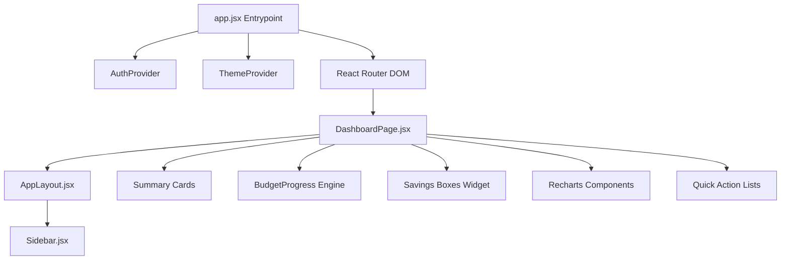
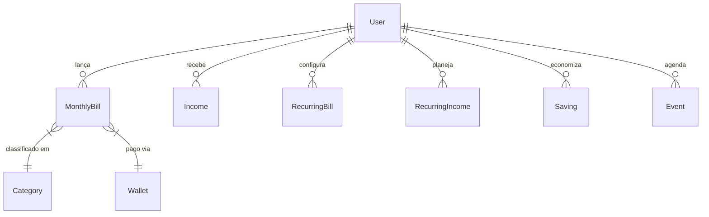
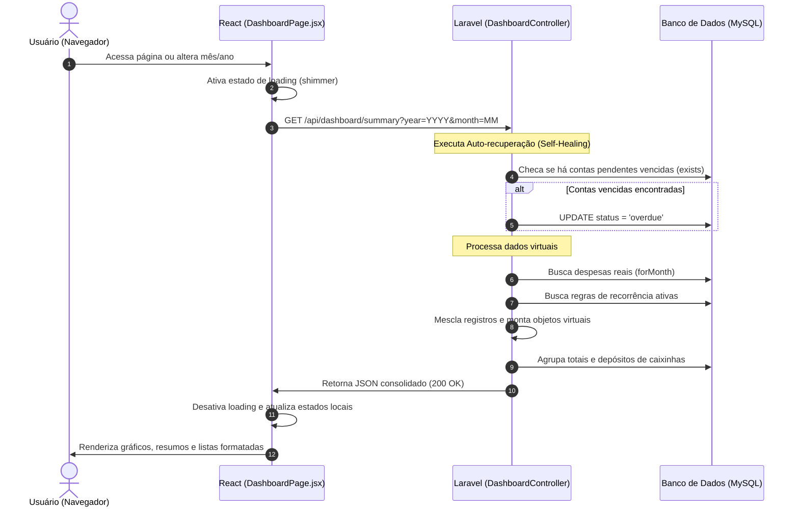

# 📊 OrganizeLife Dashboard — Arquitetura & Design

Este documento apresenta uma visão detalhada sobre a arquitetura de software, o fluxo de dados e os princípios de design visual do Dashboard principal do **OrganizeLife**. O dashboard foi projetado como uma ferramenta premium de finanças pessoais, evocando a sofisticação e a calma de uma papelaria de alta qualidade física.

---

## 🎨 1. Diretrizes de Design e Experiência do Usuário (UX/UI)

A interface do OrganizeLife afasta-se deliberadamente dos dashboards SaaS genéricos repletos de contrastes exagerados, elementos neon ou gráficos WebGL futuristas tridimensionais. Em vez disso, adota a filosofia de **estabilidade, minimalismo premium e clareza física**.

### 🎨 Paleta de Cores e Tokens OKLCH
Implementado diretamente no arquivo [app.css](file:///C:/Users/Usuario/Desktop/Programming/OrganizeLife/resources/css/app.css), o design faz uso extensivo do modelo de cores **OKLCH**, garantindo transições suaves de luminosidade e consistência cromática impecável entre os temas.

*   **Light Mode (Creme Suave):** Utiliza fundo creme acolhedor (`#F8F5EE` / `oklch(97% 0.010 80)`) com textos em carvão quente de alto contraste (`oklch(13% 0.012 75)`) e bordas extra-finas (1px).
*   **Dark Mode (Noite Quente / Obsidian):** Transiciona para um fundo cinza carvão profundo (`#111110` / `oklch(11% 0.008 75)`) com cartões em tons terrosos (`oklch(23% 0.010 75)`).
*   **Acentos da Marca:**
    *   **Primário (Warm Sand / Amber):** `#C9AA72` (`oklch(72% 0.082 74)`) — usado para CTAs, botões principais e estados ativos.
    *   **Success (Mint Emerald):** `oklch(62% 0.160 155)` — indica saldos positivos e depósitos em caixinhas.
    *   **Danger (Crimson Rose):** `oklch(58% 0.190 25)` — reservado exclusivamente para contas atrasadas ou alertas críticos.

> [!NOTE]
> Para garantir a consistência estética, o sistema de cores do OrganizeLife restringe o uso de cores vibrantes apenas a alertas críticos ou status informativos essenciais. Elementos decorativos puramente visuais são omitidos para reduzir a carga cognitiva.

### ✍️ Tipografia
*   **Títulos & Logotipos:** A fonte premium `Plus Jakarta Sans` é empregada em headers, badges e seções de destaque para conferir elegância moderna.
*   **Corpo de Texto e Indicadores:** A fonte geométrica `Geist` é usada em rótulos e listas. Valores numéricos utilizam a variante tabular monoespaçada para garantir alinhamento perfeito de colunas contábeis e facilitar a leitura imediata.

### ✨ Animações e Micro-interações
*   **Entrada de Página:** A classe `.page-enter` no [app.css](file:///C:/Users/Usuario/Desktop/Programming/OrganizeLife/resources/css/app.css#L325-L332) realiza uma suave transição de entrada (`opacity` e `translateY`) usando uma curva de suavização personalizada `cubic-bezier(0.16, 1, 0.3, 1)` durante 500ms.
*   **Hover Lift:** Os cartões reagem a interações do usuário elevando-se ligeiramente com `translateY(-2px)` e aplicando um sombreamento suave (`var(--shadow-md)`), conferindo sensação tátil aos elementos.
*   **Skeletons de Carregamento:** A animação de `shimmer` em gradiente no background sinaliza transições de estados de carregamento assíncrono.
*   **Acessibilidade de Movimento:** O sistema escuta a mídia de acessibilidade do navegador `@media (prefers-reduced-motion: reduce)`. Caso ativa, todas as transições caem para `0.01ms`, animações de ondas e partículas em SVG são ocultadas e os movimentos contínuos no GPU são desativados de imediato.

---

## 🛠️ 2. Arquitetura de Software do Dashboard

O dashboard do OrganizeLife segue uma arquitetura baseada em **SPA (Single Page Application)** no frontend e uma **RESTful API** no backend, orquestrada de forma coesa e com foco em alta performance e baixa latência de rede.

### 🌐 Visão de Componentes (Frontend)

O frontend é implementado em **React** e gerenciado a partir da rota `/dashboard` no componente [DashboardPage.jsx](file:///C:/Users/Usuario/Desktop/Programming/OrganizeLife/resources/js/pages/DashboardPage.jsx).



Os principais blocos de interface contidos na página são:
1.  **Navegador de Período:** Permite transitar livremente entre meses e anos anteriores/futuros. Modificações de estado neste navegador acionam novas requisições reativas da API por meio do hook `useEffect`.
2.  **Summary Cards:** Quatro cartões principais exibindo Renda Prevista, Gastos Previstos, Balanço Projetado e Total Pendente/Atrasado.
3.  **BudgetProgress (Orçamento Inteligente):** Renderiza três barras de progresso baseadas na regra do orçamento ativo (ex: 50% Essenciais, 30% Desejos, 20% Caixinhas/Investimentos).
4.  **Caixinhas (Reservas):** Exibe cartões das metas de poupança ativas do usuário e seu percentual de conclusão.
5.  **Gráficos Interativos (Recharts):**
    *   **Histórico de Gastos:** Gráfico de barras combinando gastos previstos versus pagos nos últimos 6 meses.
    *   **Gastos por Categoria:** Gráfico de rosca (`PieChart` com `innerRadius`) mapeando a distribuição setorial das despesas.
6.  **Quick Lists:** Três cartões listando as 5 próximas contas a vencer, contas que já se encontram em atraso e eventos futuros agendados no calendário.

---

## 🔌 3. Arquitetura de Dados & API (Backend)

O backend é desenvolvido em **Laravel** e adota o padrão de controladores API puros, respondendo payloads padronizados em JSON.

### ⚡ Padrão de API Consolidada (Single-Endpoint Performance)
Para mitigar problemas clássicos de excesso de requisições de rede (*overfetching* e *n+1 requests* no carregamento inicial), a API expõe o endpoint centralizado:
```http
GET /api/dashboard/summary?year=2026&month=5
```
Este endpoint é manipulado pelo método `summary` do [DashboardController.php](file:///C:/Users/Usuario/Desktop/Programming/OrganizeLife/app/Http/Controllers/Api/DashboardController.php#L18-L139). Ele agrupa dados financeiros de despesas, rendimentos, caixinhas, categorias, agenda e metas em um único payload JSON estruturado.

### 💾 Modelo de Dados e Relacionamentos
A estrutura de banco de dados do dashboard mapeia o usuário do sistema ([User.php](file:///C:/Users/Usuario/Desktop/Programming/OrganizeLife/app/Models/User.php)) às suas respectivas entidades financeiras através do ORM Eloquent:



---

## ⚙️ 4. Padrões de Engenharia Críticos no Dashboard

### 🔄 A. Mecanismo de Auto-recuperação (Self-Healing Overdue Bills)
Ao carregar o resumo financeiro, o backend verifica se existem contas pendentes cujo prazo de vencimento já expirou com base na data do servidor. 
Para evitar escritas desnecessárias no banco de dados durante operações típicas de leitura (`GET`), o [DashboardController.php](file:///C:/Users/Usuario/Desktop/Programming/OrganizeLife/app/Http/Controllers/Api/DashboardController.php#L24-L36) faz uma checagem rápida com o método `.exists()` antes de persistir as mudanças:

```php
$hasOverdue = $user->monthlyBills()
    ->where('status', MonthlyBill::STATUS_PENDING)
    ->where('due_date', '<', now()->toDateString())
    ->exists();

if ($hasOverdue) {
    $user->monthlyBills()
        ->where('status', MonthlyBill::STATUS_PENDING)
        ->where('due_date', '<', now()->toDateString())
        ->update(['status' => MonthlyBill::STATUS_OVERDUE]);
}
```

### 🔮 B. Virtualização de Transações Recorrentes
Ao invés de popular previamente o banco de dados com centenas de linhas de contas recorrentes para os meses futuros (o que consumiria espaço em disco e causaria problemas de dessincronização se o usuário alterasse o valor original da recorrência), o sistema utiliza um padrão de **Virtualização On-the-fly**.

Tanto no [User.php:getMonthlyBillsWithVirtual](file:///C:/Users/Usuario/Desktop/Programming/OrganizeLife/app/Models/User.php#L179-L235) quanto no [User.php:getIncomesWithVirtual](file:///C:/Users/Usuario/Desktop/Programming/OrganizeLife/app/Models/User.php#L246-L296), o sistema:
1.  Recupera do banco de dados as despesas físicas criadas manualmente pelo usuário para aquele mês e ano específicos.
2.  Busca as configurações recorrentes ativas do usuário (`RecurringBill` ou `RecurringIncome`).
3.  Compara as coleções. Caso uma recorrência não tenha um correspondente físico associado no banco de dados para o período solicitado, o Laravel cria um objeto **virtual** em memória (`new MonthlyBill(...)`) contendo a flag `_virtual = true`.
4.  Gera um ID temporário estruturado para que o React consiga renderizar a lista de forma consistente sem colisões de chaves de loops DOM:
    ```php
    $virtualBill->id = "virtual-{$recur->id}-{$year}-{$month}";
    ```
5.  Quando o usuário clica para marcar uma conta virtual como paga no frontend, o sistema materializa essa conta fisicamente no banco de dados instantaneamente a partir dos dados do snapshot gerado.

> [!TIP]
> A virtualização reduz o consumo de banco de dados e simplifica a edição de recorrências. Se o usuário alterar a recorrência mensal de um serviço de streaming de R$ 30 para R$ 35, todos os meses virtuais subsequentes refletirão automaticamente a mudança sem necessidade de scripts de migração histórica.

### 🧮 C. Regras de Orçamento Inteligente (Needs/Wants/Savings)
O sistema calcula o progresso de gastos dinamicamente dividindo a despesa mensal total com base no grupo de orçamento associado à categoria da despesa.
*   **Needs (Essenciais):** Despesas associadas a categorias configuradas no grupo `needs` (ex: Contas de Luz, Aluguel, Supermercado).
*   **Wants (Desejos):** Despesas em categorias do grupo `wants` (ex: Lazer, Restaurantes, Compras).
*   **Savings (Metas):** Calculado a partir da soma dos depósitos feitos em caixinhas financeiras no período.

O frontend calcula o limite total com base na renda cadastrada do usuário no mês e compara o valor gasto real em cada categoria, disparando alertas de saturação ou ultrapassagem de limite.

---

## 📈 5. Fluxo de Dados de um Carregamento do Dashboard

A sequência a seguir ilustra o processo completo quando o usuário acessa ou altera o mês visualizado no Dashboard:


